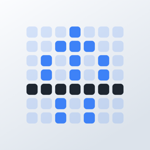
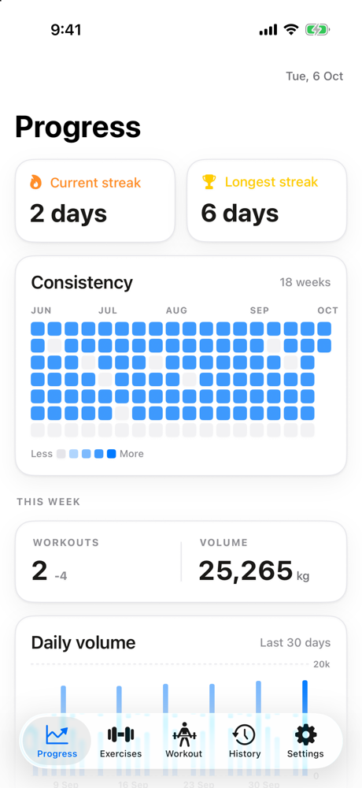
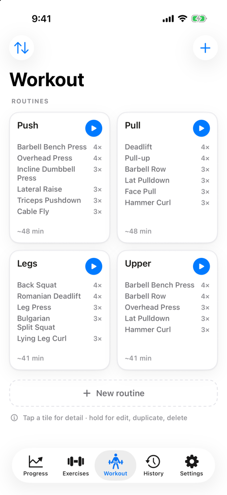
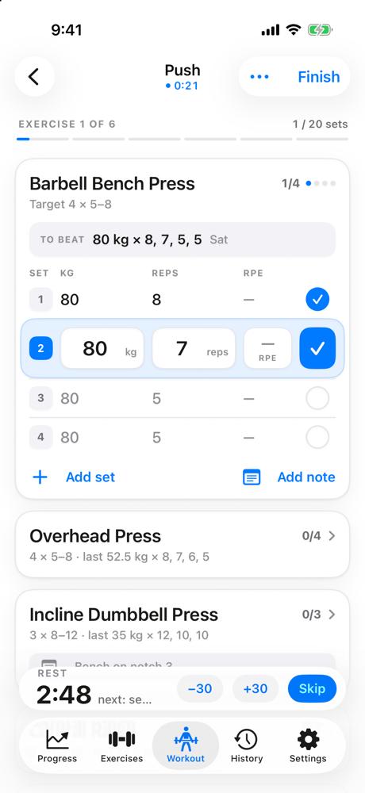
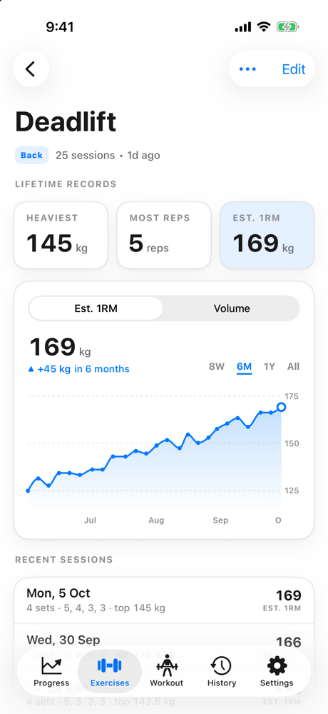
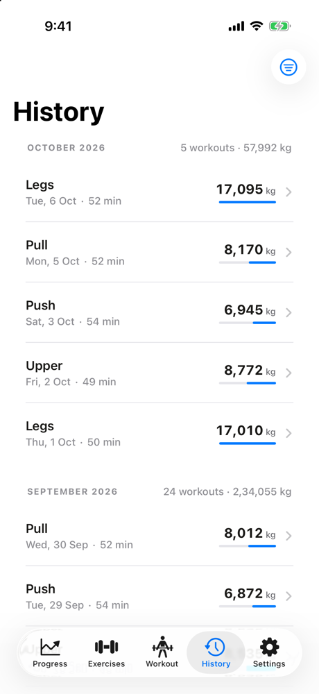
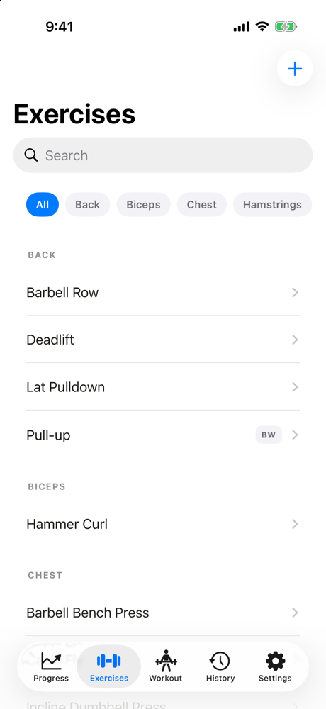
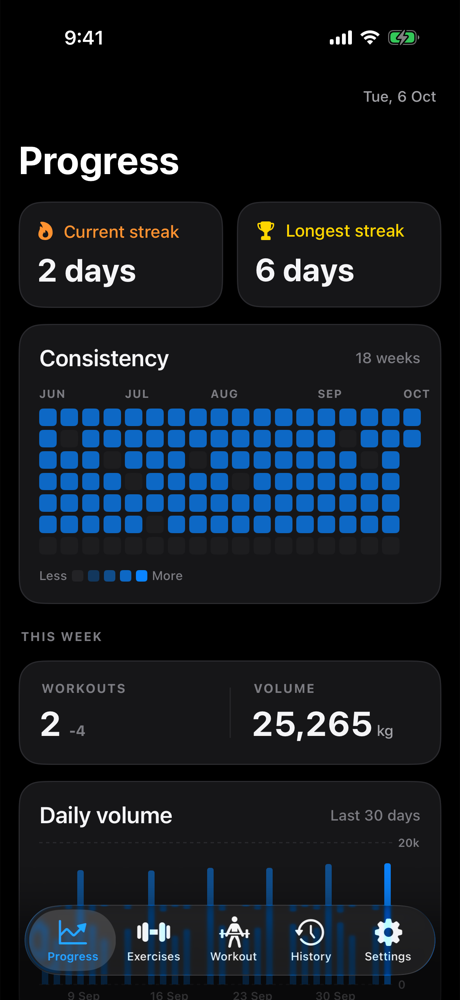

<p align="center">
  
</p>

<h1 align="center">Forge</h1>

<p align="center">
  A fast, private gym log for iPhone — plan routines, log sets in seconds, watch your lifts climb.
</p>

<p align="center">
  
  
  
  
</p>

<p align="center">
  
  
  
  
</p>

## Why

Most workout apps want an account, a subscription and your data on their servers.
Forge is the opposite: no sign-up, no network calls, no ads. Everything lives on
your phone in SwiftData, and you can export it as a single JSON file whenever
you like.

## Features

**Training**
- **Routines** in a grid you can reorder, each showing its exercises, set counts and estimated time. One tap starts a workout.
- **Fast logging.** Every set is pre-filled from last time, with a "to beat" line above it. Tick a set and the rest timer starts.
- **Rest timer** in the tab bar and as a **Live Activity** on the Lock Screen and Dynamic Island, with a notification when time's up.
- **Edit on the fly.** Drag to reorder exercises, swipe to edit or remove one, add sets or exercises, and leave a note ("rope attachment", "bench on notch 3") that carries over to next time.
- **Bodyweight and unilateral** exercises are handled properly: added load, and ×2 volume.

**Progress**
- **Streaks** and a GitHub-style **consistency heatmap**.
- **Personal records** and an **estimated one-rep max** chart for every exercise, over 8 weeks, 6 months, a year or all time.
- **Weekly and daily volume**, and a **history** grouped by month.

**Your data**
- **Automatic backups** to a folder you choose, such as iCloud Drive, after every workout.
- **Export and import** the whole library as one `.forgebackup` JSON file.
- **Shortcuts and Siri:** "Start Push in Forge".
- **kg or lb**, a custom default rest, and your own body parts.

<p align="center">
  
  
  
</p>

## Build it

You need a Mac with **Xcode 26** or later and [XcodeGen](https://github.com/yonaskolb/XcodeGen).

```bash
brew bundle            # installs XcodeGen
xcodegen generate      # creates Forge.xcodeproj from project.yml
open Forge.xcodeproj
```

To run it on your iPhone, put your team ID in `Config/Signing.local.xcconfig`:

```
DEVELOPMENT_TEAM = ABCDE12345
```

Any Apple ID works, **including a free one**. With a free account the app stops
launching after 7 days; just run it from Xcode again. **Don't delete the app to
reinstall it**, because that deletes its data. Turn on automatic backup in
Settings → Backup and restore as a safety net.

Run the tests with ⌘U, or:

```bash
xcodebuild test -scheme Forge -destination 'platform=iOS Simulator,name=iPhone 17 Pro'
```

## How it's built

| | |
|---|---|
| UI | SwiftUI with iOS 26 Liquid Glass |
| Storage | SwiftData, a single on-device store, with lightweight migrations |
| Maths | `ForgeCore`, a dependency-free Swift package for volume, e1RM (Epley), PRs, streaks and progression; unit-tested on its own |
| Extensions | WidgetKit (the rest-timer Live Activity) and App Intents (Shortcuts) |
| Project | XcodeGen (`project.yml`), so there's no `.xcodeproj` in git |
| Tests | Swift Testing, 200+ tests across the app and ForgeCore |

```
Forge/            App: features, models, persistence, design system
ForgeWidgets/     Live Activity
Packages/ForgeCore/  Pure training maths
ForgeTests/       App tests
docs/             PRD, design brief and milestone plans
scripts/          Demo-data generator used for the screenshots
```

The screenshots use generated demo data. Run
`python3 scripts/make-demo-backup.py /tmp/demo.forgebackup`, then launch a Debug
build with `-demoBackupPath /tmp/demo.forgebackup`.

## Roadmap

- [ ] Apple Watch companion: log sets and see rest from your wrist
- [ ] Body measurements
- [ ] Home Screen widgets

## License

[MIT](LICENSE)
